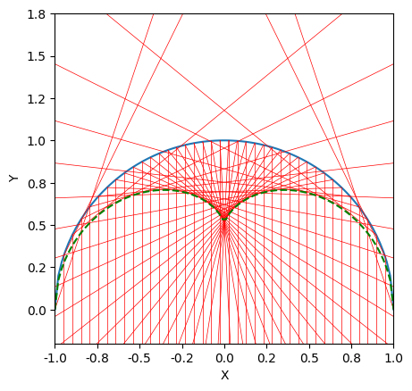

# Caustics
### About
Assortment of Python 3.11 functions and scripts that complement an optics class project on caustics. It includes all the programmes I used to generate my figures. The project in question is `intro_to_caustics.pdf`.

### How to install
1. Clone the repo and open it from the CLI.
1. (Optional) Create a virtual environment with `python -m venv venv` and `venv/Scripts/activate`.
1. Run `pip install -r requirements.txt`.

All scripts in the project folder should now work.

### Contents
The project itself, `intro_to_caustics.pdf`, gives a brief mathematical overview of caustics. The `images` folder contains all the figures I generated for it. As for the Python files, they do the following:
1. `catastrophes.py`: Generates a figure with elementary catastrophes of codim <= 3 when run.
1. `caustics.py`: Contains two functions, `catacaustic(u,v,x,y)` and `diacaustic(u,v,x,y,mu),` which calculate and plot the direction of the first deflection of rays on some 2D boundary &mdash; the shape of the boundary is specified by `(u,v)` and the direction of incident rays is specified by `(x,y)`. The file also contains the parent function `caustic(u,v,x,y,d)`, with a modifiable deflection equation `d`.
1. `dispersion.py`: When run renders the caustic of colours created by dispersion of a white light beam in an optical prism.
1. `farfield.py`: When run generates a random wavefront propagating along the optical axis Z, and its far field caustics.